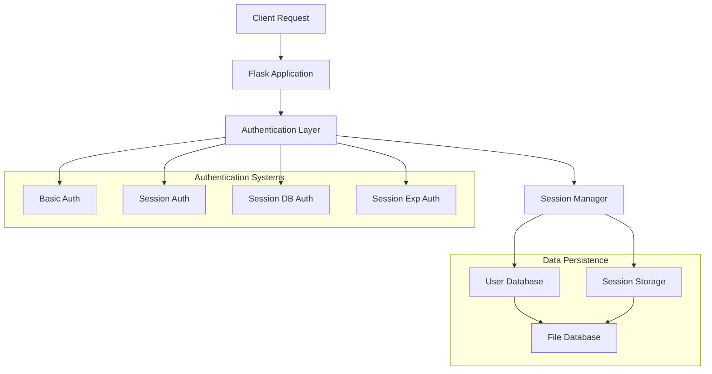
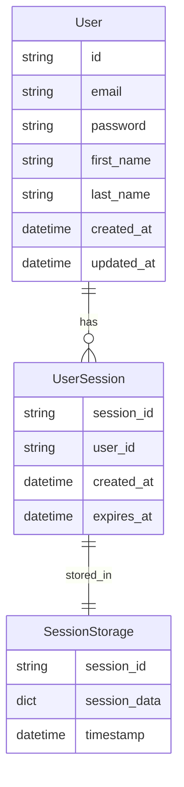
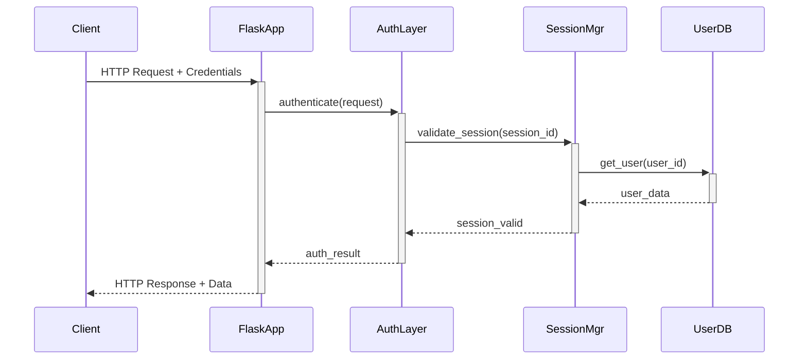

# 🏗️ System Architecture

## 📖 Overview
Session Authentication API system demonstrating advanced authentication mechanisms including basic authentication, session management, session expiration, and database-backed sessions. This educational project showcases secure user authentication patterns and session handling in Flask-based REST APIs.

---

## 🏛️ High-Level Architecture



The system implements a layered authentication architecture with multiple authentication strategies, session management capabilities, and persistent storage for both user data and session information.

---

## 🧩 Core Components

### Flask Application Layer
- **Purpose**: HTTP request handling and API endpoint management
- **Technology**: Python Flask, Flask-CORS
- **Location**: `api/v1/app.py`
- **Responsibilities**:
  - Route registration and request routing
  - CORS policy management
  - Authentication type configuration
  - Error handling and response formatting
- **Interfaces**: RESTful HTTP API endpoints

### Authentication Framework
- **Purpose**: Pluggable authentication system supporting multiple auth strategies
- **Technology**: Python inheritance and polymorphism
- **Location**: `api/v1/auth/`
- **Responsibilities**:
  - Base authentication interface definition
  - Authentication strategy selection
  - Request authorization validation
  - User session management
- **Interfaces**: Abstract base class with concrete implementations

### Session Management System
- **Purpose**: User session creation, validation, and lifecycle management
- **Technology**: Python session handling, file-based persistence
- **Location**: `api/v1/auth/session_*.py`
- **Responsibilities**:
  - Session ID generation and tracking
  - Session expiration handling
  - Database-backed session persistence
  - Memory and disk session storage
- **Interfaces**: Session authentication protocols

### User Model & Storage
- **Purpose**: User data modeling and persistence
- **Technology**: Python file-based database simulation
- **Location**: `models/`
- **Responsibilities**:
  - User data serialization/deserialization
  - File-based data persistence
  - User model validation
  - Database simulation operations
- **Interfaces**: Model-based data access patterns

### API Views Layer
- **Purpose**: Business logic implementation and endpoint handlers
- **Technology**: Flask Blueprint pattern
- **Location**: `api/v1/views/`
- **Responsibilities**:
  - User CRUD operations
  - Authentication endpoint handling
  - Status and statistics reporting
  - Request/response data transformation
- **Interfaces**: RESTful resource management

---

## 📊 Data Models & Schema



### Key Data Entities
- **User**: Core user account information with authentication credentials
- **UserSession**: Session tracking for authenticated users with expiration
- **SessionStorage**: Persistent session data storage with metadata

### Relationships
- User → UserSession: One-to-many relationship for multiple active sessions
- UserSession → SessionStorage: One-to-one mapping for session persistence

---

## 🔄 Data Flow & Interactions



### Request/Response Flow
1. **Request Reception**: Flask application receives HTTP request with authentication data
2. **Authentication Processing**: Auth layer selects appropriate authentication strategy
3. **Session Validation**: Session manager validates existing sessions or creates new ones
4. **User Verification**: User database confirms user existence and credentials
5. **Response Generation**: System returns appropriate response with session information

---

## 🚀 Deployment & Environment

### Development Environment
- **Platform**: Python 3.x on Unix-like systems
- **Dependencies**: Flask, Flask-CORS, Python standard library
- **Setup**: Virtual environment with pip package management

### Production Considerations
- **Scalability**: File-based storage limits concurrent user capacity
- **Performance**: In-memory session caching for improved response times
- **Monitoring**: Flask development server with request logging

### Configuration Management
- **Environment Variables**: AUTH_TYPE for authentication strategy selection
- **Secrets**: Password hashing and session key management
- **Feature Flags**: Authentication type switching via environment configuration

---

## 🔒 Security Architecture

### Authentication & Authorization
- **Authentication**: Multi-strategy approach (Basic, Session, Database-backed)
- **Authorization**: Role-based access control for protected endpoints
- **Session Management**: Secure session ID generation and validation

### Data Protection
- **Encryption**: Password hashing using secure algorithms
- **Input Validation**: Request data sanitization and validation
- **Data Privacy**: User data isolation and access control

### Security Measures
- **Session Expiration**: Time-based session invalidation
- **CORS Protection**: Cross-origin request security
- **SQL Injection Prevention**: Parameterized data access patterns

---

## ⚡ Error Handling & Resilience

### Error Management Strategy
- **Error Detection**: Exception handling throughout authentication pipeline
- **Error Reporting**: Structured HTTP error responses with appropriate status codes
- **Error Recovery**: Graceful fallback to alternative authentication methods

### Resilience Patterns
- **Circuit Breaker**: Authentication failure handling and recovery
- **Retry Logic**: Database operation retry mechanisms

---

## 🎯 Design Decisions & Trade-offs

### Key Architectural Decisions
1. **File-based Database**
   - **Decision**: Use JSON file storage instead of traditional database
   - **Rationale**: Educational simplicity and zero external dependencies
   - **Alternatives**: SQLite, PostgreSQL, MongoDB
   - **Trade-offs**: Simplified setup vs. limited scalability and concurrent access

2. **Multiple Authentication Strategies**
   - **Decision**: Implement pluggable authentication system
   - **Rationale**: Demonstrate various authentication patterns in single codebase
   - **Alternatives**: Single authentication method implementation
   - **Trade-offs**: Educational completeness vs. increased complexity

### Known Limitations
- **Concurrent Access**: File-based storage not suitable for high concurrency
- **Session Persistence**: In-memory sessions lost on server restart

### Future Considerations
- **Database Migration**: Transition to relational database for production use
- **Caching Layer**: Redis integration for session storage
- **Security Hardening**: Enhanced encryption and security measures

---

## 📁 Directory Structure & Organization

```
0x02-Session_authentication/
├── api/                    # API implementation
│   └── v1/                 # API version 1
│       ├── app.py          # Flask application entry point
│       ├── auth/           # Authentication implementations
│       │   ├── auth.py     # Base authentication class
│       │   ├── basic_auth.py    # Basic authentication
│       │   ├── session_auth.py  # Session authentication
│       │   ├── session_db_auth.py   # Database session auth
│       │   └── session_exp_auth.py  # Expiring session auth
│       └── views/          # API endpoint handlers
│           ├── index.py    # Status and stats endpoints
│           └── users.py    # User management endpoints
├── models/                 # Data models
│   ├── base.py            # Base model with serialization
│   └── user.py            # User model implementation
├── main_*.py              # Test/demo scripts
└── requirements.txt       # Python dependencies
```

### Organization Principles
- **Layered Architecture**: Clear separation between API, authentication, and data layers
- **Strategy Pattern**: Pluggable authentication implementations
- **Blueprint Pattern**: Modular API endpoint organization

---

## 🔗 External Dependencies

| Dependency | Purpose | Version | Documentation |
|------------|---------|---------|---------------|
| Flask | Web framework | 2.0+ | [Flask Docs](https://flask.palletsprojects.com/) |
| Flask-CORS | Cross-origin requests | 3.0+ | [Flask-CORS](https://flask-cors.readthedocs.io/) |

---

## 📚 References
- [Project README](README.md)
- [ALX Backend User Data](../README.md)
- [Authentication Best Practices](https://owasp.org/www-project-cheat-sheets/cheatsheets/Authentication_Cheat_Sheet.html)
