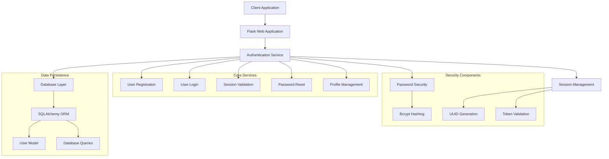
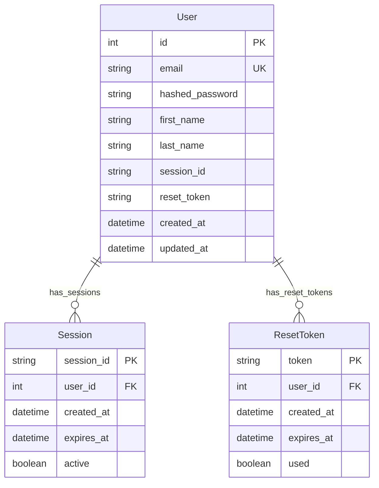
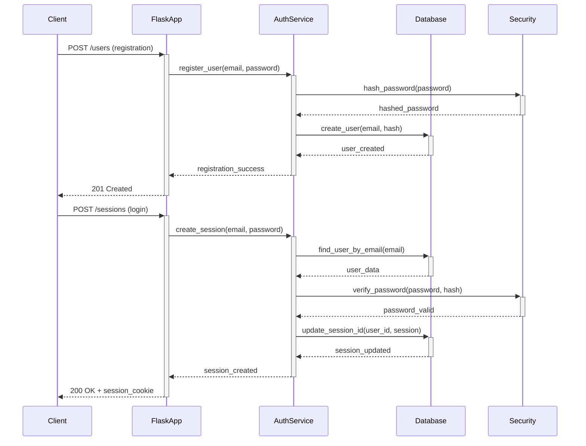

# 🏗️ System Architecture

## 📖 Overview
Comprehensive User Authentication Service implementing a complete authentication backend with user registration, login, session management, password reset functionality, and secure profile management. This educational project demonstrates production-ready authentication patterns using Flask, SQLAlchemy, and bcrypt for secure user management.

---

## 🏛️ High-Level Architecture



The system implements a comprehensive authentication service with secure user management, session handling, and database persistence using industry-standard security practices.

---

## 🧩 Core Components

### Flask Application Layer
- **Purpose**: HTTP request handling and web service endpoints
- **Technology**: Python Flask with routing and request processing
- **Location**: `app.py`
- **Responsibilities**:
  - HTTP endpoint routing and management
  - Request/response handling and validation
  - Error handling and status code management
  - Session cookie management
- **Interfaces**: RESTful web service API

### Authentication Service Engine
- **Purpose**: Core authentication business logic and user management
- **Technology**: Python with bcrypt for password security
- **Location**: `auth.py`
- **Responsibilities**:
  - User registration and validation
  - Password hashing and verification
  - Session creation and management
  - Password reset token generation
  - User profile updates
- **Interfaces**: Service layer API for authentication operations

### Database Integration Layer
- **Purpose**: Data persistence and user model management
- **Technology**: SQLAlchemy ORM with database abstraction
- **Location**: `db.py`, `user.py`
- **Responsibilities**:
  - Database connection management
  - User model definition and relationships
  - CRUD operations for user data
  - Query optimization and data validation
- **Interfaces**: ORM-based data access layer

### User Model System
- **Purpose**: User data representation and validation
- **Technology**: SQLAlchemy declarative models
- **Location**: `user.py`
- **Responsibilities**:
  - User schema definition
  - Data validation and constraints
  - Relationship mapping
  - Model serialization
- **Interfaces**: Object-relational mapping interface

### Security Infrastructure
- **Purpose**: Password security and token management
- **Technology**: bcrypt, uuid, hashlib
- **Location**: Integrated throughout `auth.py`
- **Responsibilities**:
  - Password hashing with salt
  - Session ID generation
  - Reset token creation and validation
  - Secure random value generation
- **Interfaces**: Security utility functions

---

## 📊 Data Models & Schema



### Key Data Entities
- **User**: Core user account with authentication credentials and profile information
- **Session**: Active user sessions with expiration and validation tracking
- **ResetToken**: Password reset tokens with time-based expiration and usage tracking

### Relationships
- User → Session: One-to-many relationship for multiple concurrent sessions
- User → ResetToken: One-to-many relationship for password reset history

---

## 🔄 Data Flow & Interactions



### Request/Response Flow
1. **User Registration**: Client submits credentials, system validates and creates secure user account
2. **Authentication**: System validates credentials against stored hash and creates session
3. **Session Management**: Active sessions tracked with secure session IDs
4. **Password Reset**: Token-based password reset with time-limited validity
5. **Profile Management**: Authenticated users can update profile information

---

## 🚀 Deployment & Environment

### Development Environment
- **Platform**: Python 3.x with SQLAlchemy and Flask
- **Dependencies**: Flask, SQLAlchemy, bcrypt, uuid
- **Setup**: Local development with SQLite database

### Production Considerations
- **Scalability**: Database-backed authentication with connection pooling
- **Performance**: Optimized queries and password hashing performance
- **Monitoring**: Request logging and authentication failure tracking

### Configuration Management
- **Environment Variables**: Database URL, secret keys, security settings
- **Secrets**: Password salt management and session encryption keys
- **Feature Flags**: Authentication method configuration and security levels

---

## 🔒 Security Architecture

### Authentication & Authorization
- **Authentication**: Email/password-based with secure password hashing
- **Authorization**: Session-based access control for protected resources
- **Session Management**: Secure session ID generation and validation

### Data Protection
- **Encryption**: bcrypt password hashing with automatic salt generation
- **Input Validation**: Email format validation and password strength requirements
- **Data Privacy**: User data access control and secure storage

### Security Measures
- **Password Security**: bcrypt hashing with computational cost factor
- **Session Security**: UUID-based session IDs with server-side validation
- **Reset Token Security**: Time-limited password reset tokens with single use

---

## ⚡ Error Handling & Resilience

### Error Management Strategy
- **Error Detection**: Comprehensive exception handling throughout authentication flow
- **Error Reporting**: Structured HTTP responses with appropriate status codes
- **Error Recovery**: Graceful degradation and user-friendly error messages

### Resilience Patterns
- **Database Retry**: Connection retry logic for database operations
- **Validation Fallback**: Input validation with helpful error messaging

---

## 🎯 Design Decisions & Trade-offs

### Key Architectural Decisions
1. **SQLAlchemy ORM Usage**
   - **Decision**: Use SQLAlchemy for database operations instead of raw SQL
   - **Rationale**: Type safety, query optimization, and database abstraction
   - **Alternatives**: Raw SQL, other ORMs, NoSQL solutions
   - **Trade-offs**: Learning curve vs. development productivity and security

2. **bcrypt for Password Hashing**
   - **Decision**: Implement bcrypt for password security
   - **Rationale**: Industry standard with adaptive cost and built-in salt
   - **Alternatives**: PBKDF2, scrypt, Argon2
   - **Trade-offs**: Computational cost vs. security strength

### Known Limitations
- **Session Storage**: In-database session storage may impact performance at scale
- **Password Reset**: Email delivery not implemented (token generation only)

### Future Considerations
- **Multi-factor Authentication**: SMS/TOTP integration for enhanced security
- **OAuth Integration**: Social login capabilities
- **API Rate Limiting**: Request throttling for abuse prevention

---

## 📁 Directory Structure & Organization

```
0x03-user_authentication_service/
├── app.py                  # Flask application with authentication endpoints
├── auth.py                 # Authentication service with business logic
├── db.py                   # Database management and connection handling
├── user.py                 # User model definition and database schema
├── main_*.py              # Test scripts and validation tools
├── requirements.txt       # Python dependencies
└── README.md              # Project documentation
```

### Organization Principles
- **Single Responsibility**: Each module handles specific authentication concerns
- **Service Layer Pattern**: Clear separation between web layer and business logic
- **Model-View-Controller**: Clean architecture with defined layer boundaries

---

## 🔗 External Dependencies

| Dependency | Purpose | Version | Documentation |
|------------|---------|---------|---------------|
| Flask | Web framework | 2.0+ | [Flask Docs](https://flask.palletsprojects.com/) |
| SQLAlchemy | ORM and database toolkit | 1.4+ | [SQLAlchemy Docs](https://docs.sqlalchemy.org/) |
| bcrypt | Password hashing | 3.2+ | [bcrypt Docs](https://pypi.org/project/bcrypt/) |

---

## 📚 References
- [Project README](README.md)
- [ALX Backend User Data](../README.md)
- [OWASP Authentication Guide](https://owasp.org/www-project-cheat-sheets/cheatsheets/Authentication_Cheat_Sheet.html)
- [Flask Security Best Practices](https://flask.palletsprojects.com/en/2.0.x/security/)
