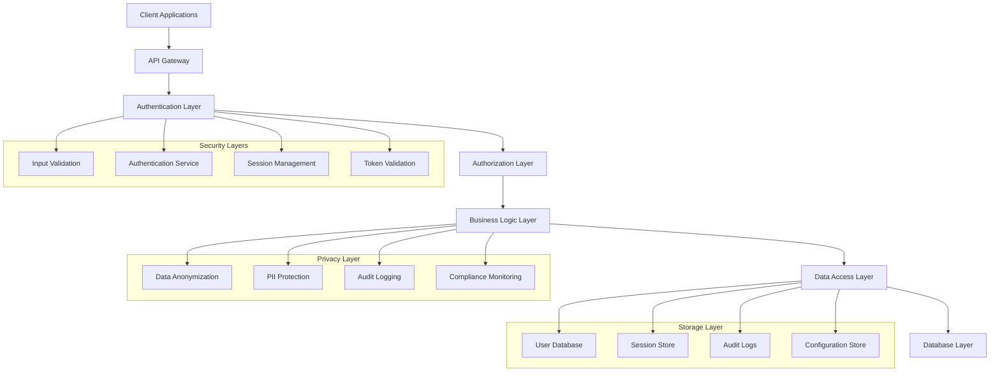
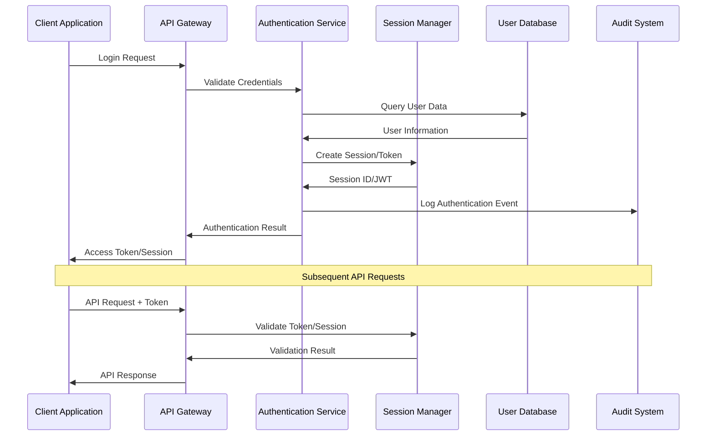
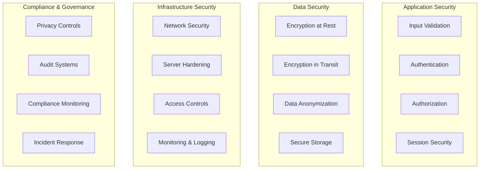
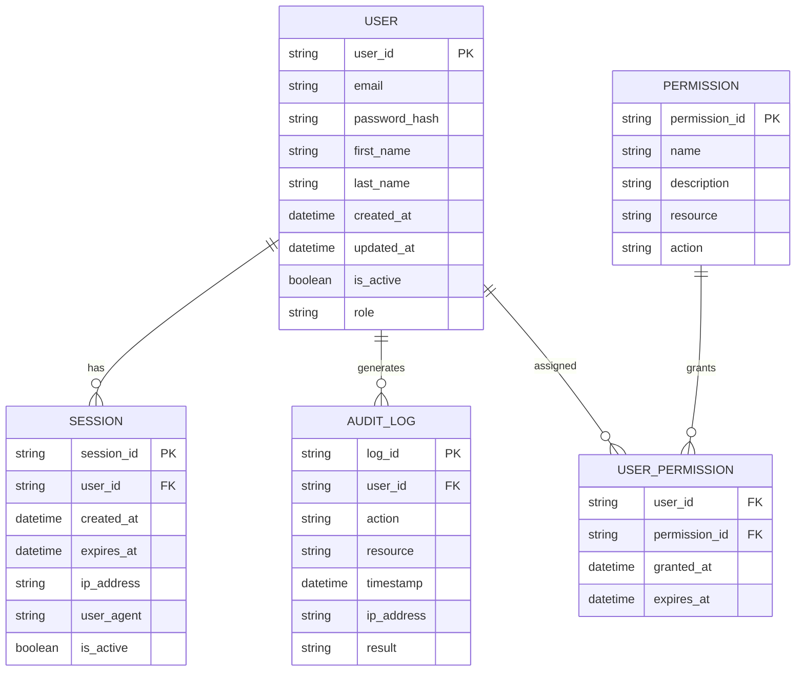
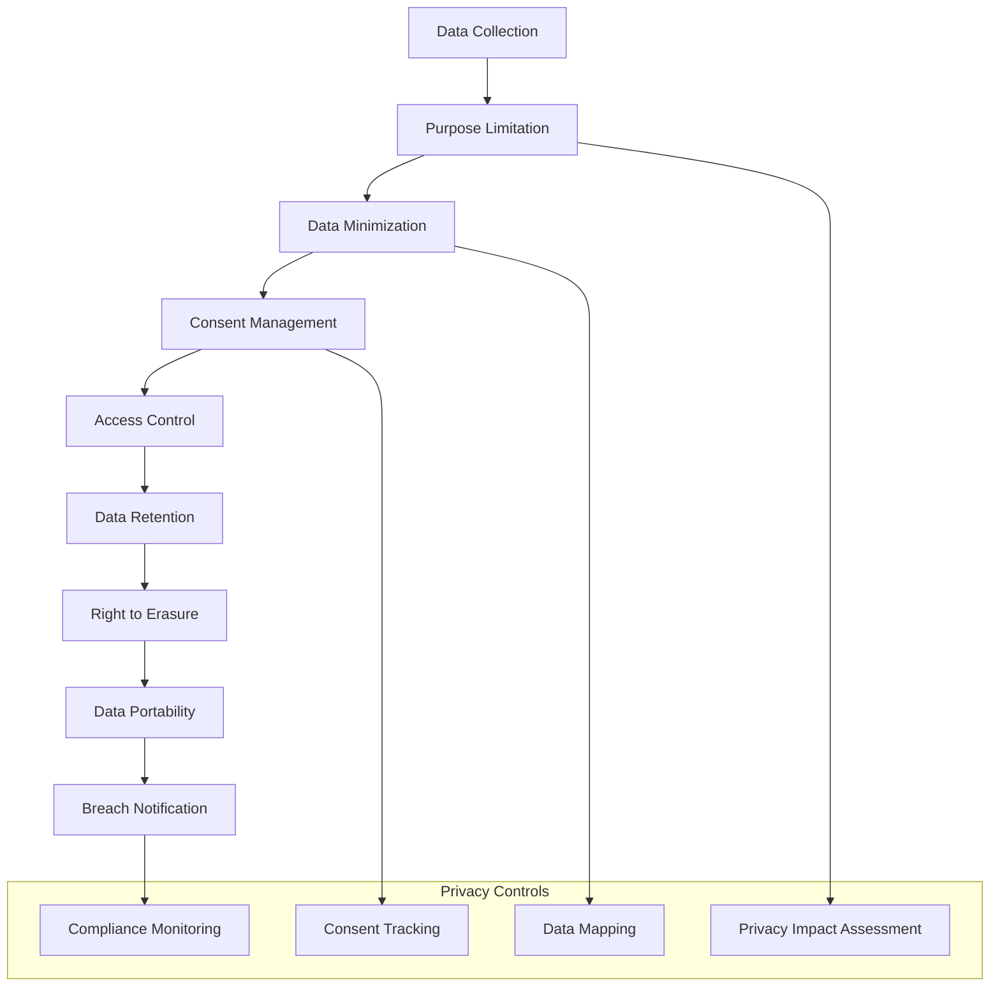
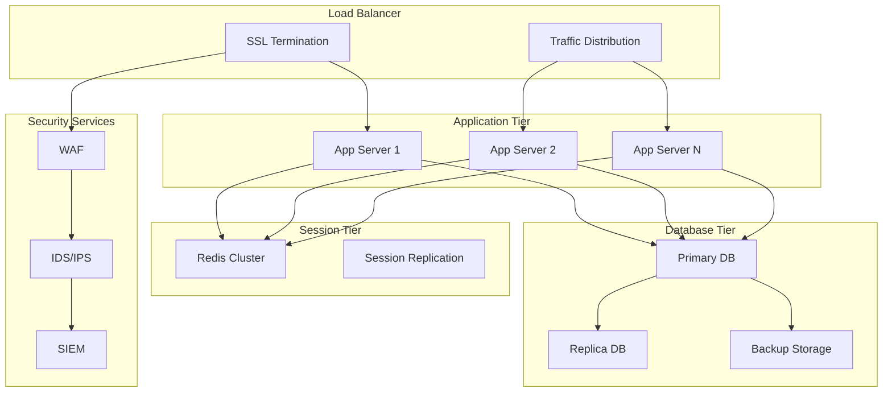
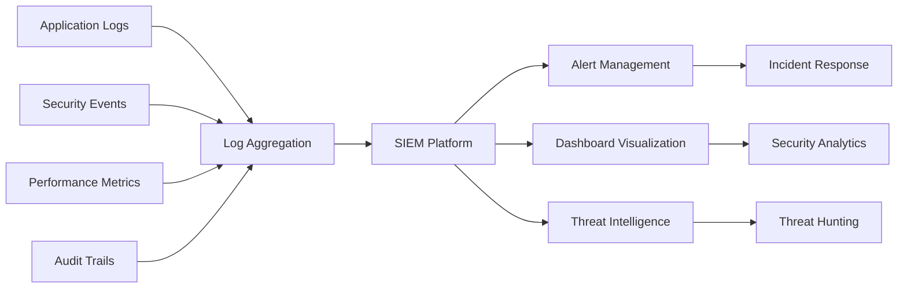
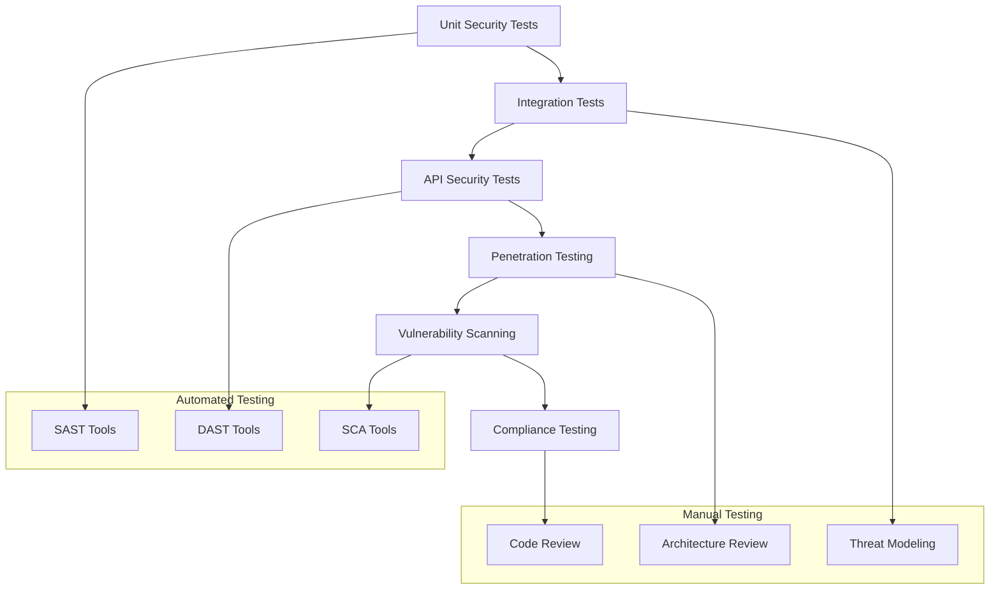
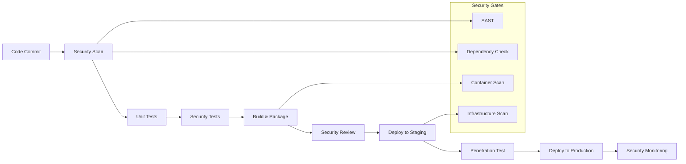

# 🏗️ System Architecture

## 📖 Overview
This repository implements a comprehensive security-focused backend architecture for user authentication, data privacy, and secure application development. The architecture demonstrates progressive security implementation from basic authentication to advanced user management systems, emphasizing privacy-by-design principles and compliance with data protection regulations.

---

## 🏛️ High-Level Architecture

The architecture follows a layered security approach with defense-in-depth principles and privacy-by-design implementation.

---

## 🧩 Core Components

### API Gateway Layer
- **Purpose**: Central entry point for all client requests with security enforcement
- **Technology**: Flask application server, reverse proxy integration
- **Location**: Entry point across all projects (`app.py` files)
- **Responsibilities**:
  - Request routing and load balancing
  - Rate limiting and DDoS protection
  - SSL/TLS termination and encryption
  - Initial security validation and filtering
  - CORS policy enforcement

### Authentication Service Layer
- **Purpose**: Comprehensive user identity verification and credential management
- **Technology**: Flask, bcrypt, JWT, session management
- **Location**: `0x01-Basic_authentication/`, `0x02-Session_authentication/`, `0x03-user_authentication_service/`
- **Responsibilities**:
  - User registration and credential validation
  - Multi-factor authentication implementation
  - Password policy enforcement and secure hashing
  - Authentication token generation and validation
  - Session lifecycle management

### Authorization & Access Control
- **Purpose**: Fine-grained access control and permission management
- **Technology**: Role-based access control (RBAC), attribute-based access control
- **Location**: `api/v1/auth/` directories across projects
- **Responsibilities**:
  - User role and permission management
  - Resource-level access control
  - API endpoint protection
  - Dynamic permission evaluation
  - Audit trail for access decisions

### Data Privacy & Protection Layer
- **Purpose**: Comprehensive data protection and privacy compliance
- **Technology**: Encryption libraries, anonymization algorithms, audit systems
- **Location**: `0x00-personal_data/`
- **Responsibilities**:
  - PII identification and classification
  - Data anonymization and pseudonymization
  - Encryption at rest and in transit
  - Privacy policy enforcement
  - GDPR compliance automation

### Business Logic Layer
- **Purpose**: Core application functionality with integrated security
- **Technology**: Flask, SQLAlchemy, secure coding practices
- **Location**: Main application modules across all projects
- **Responsibilities**:
  - Secure business logic implementation
  - Input validation and sanitization
  - Business rule enforcement
  - Error handling and logging
  - Transaction management

---

## 🔄 Authentication Flow Architecture

---

## 🔐 Security Architecture

### Multi-Layer Security Model

### Security Controls Implementation
- **Authentication Security**: Multi-factor authentication, password policies, account lockout
- **Session Security**: Secure session management, CSRF protection, session timeout
- **Data Protection**: Encryption, data classification, access logging
- **API Security**: Input validation, rate limiting, secure headers

---

## 🗄️ Data Architecture

### User Data Model

### Data Protection Strategies
- **Encryption**: AES-256 encryption for sensitive data at rest
- **Hashing**: bcrypt for password hashing with salt
- **Anonymization**: PII masking and pseudonymization
- **Access Control**: Row-level security and data classification

---

## 🔧 Privacy by Design Architecture

### Privacy Implementation Layers

### GDPR Compliance Implementation
- **Lawful Basis**: Consent management and legal basis tracking
- **Data Subject Rights**: Access, rectification, erasure, portability
- **Privacy by Default**: Privacy-preserving default configurations
- **Data Protection Impact Assessment**: Automated privacy risk assessment

---

## 🚀 Deployment Architecture

### Production Environment

### Security Infrastructure
- **Web Application Firewall**: SQL injection and XSS protection
- **Intrusion Detection**: Real-time threat monitoring
- **Security Information Event Management**: Centralized security logging
- **Distributed Denial of Service Protection**: Traffic filtering and rate limiting

---

## 📊 Monitoring & Observability

### Security Monitoring Stack

### Key Performance Indicators
- **Authentication Metrics**: Login success/failure rates, MFA adoption
- **Security Metrics**: Threat detection rate, incident response time
- **Privacy Metrics**: Data breach incidents, consent compliance rates
- **Performance Metrics**: API response times, system availability

---

## 🧪 Testing Architecture

### Security Testing Framework

### Testing Strategies
- **Static Application Security Testing**: Code vulnerability analysis
- **Dynamic Application Security Testing**: Runtime security testing
- **Interactive Application Security Testing**: Real-time security feedback
- **Software Composition Analysis**: Third-party component vulnerability scanning

---

## 🔄 DevSecOps Integration

### Secure Development Pipeline

### Continuous Security
- **Shift-Left Security**: Early integration of security in development
- **Automated Security Testing**: Continuous security validation
- **Infrastructure as Code Security**: Secure infrastructure deployment
- **Runtime Security Monitoring**: Real-time threat detection and response

---

## 📈 Scalability & Performance

### Horizontal Scaling Strategy
- **Stateless Application Design**: Session externalization for scalability
- **Database Scaling**: Read replicas and connection pooling
- **Caching Strategy**: Redis for session and data caching
- **Load Balancing**: Distributed request handling

### Performance Optimization
- **Database Optimization**: Query optimization and indexing
- **Caching Implementation**: Multi-layer caching strategy
- **Connection Pooling**: Efficient database connection management
- **Asynchronous Processing**: Non-blocking operations for better performance

---

## 🔧 Configuration Management

### Security Configuration
- **Environment-based Configuration**: Secure configuration management
- **Secrets Management**: Encrypted secrets and key rotation
- **Security Headers**: Comprehensive security header implementation
- **Certificate Management**: SSL/TLS certificate lifecycle management

### Compliance Configuration
- **Privacy Settings**: GDPR compliance configuration
- **Audit Configuration**: Comprehensive audit trail setup
- **Retention Policies**: Data retention and deletion policies
- **Backup Configuration**: Secure backup and recovery procedures

---

*This architecture provides a comprehensive foundation for secure backend development, user authentication, and data privacy compliance, demonstrating industry best practices and regulatory requirements.*
